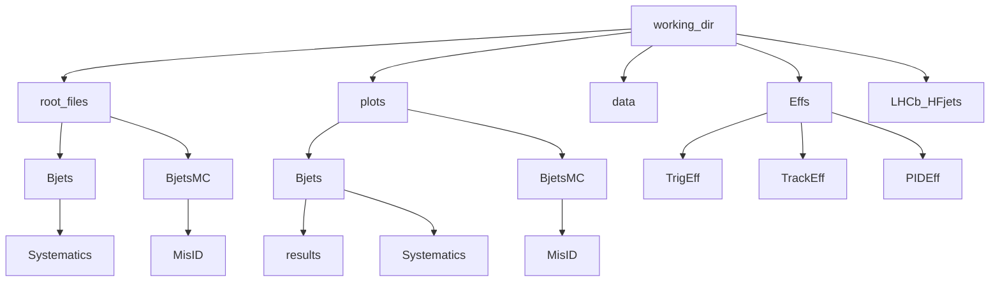

# Analysis Repo Documentation

This is the analysis repository for the measurement of jet fragmentation functions for $B^{\pm} (\to J/\psi (\to \mu^{+} \mu^{-})K^{\pm})$ decays in jets using data from $pp$ collisions recorded at $\sqrt{s} = 13$ TeV between 2016-2018 at LHCb. See the [analysis wiki](https://gitlab.cern.ch/LHCb-QEE/hfjetfragmentation/-/wikis/Run2-BJetFragmentation) for more information and the [ALCM page](https://lbfence.cern.ch/alcm/analysis/details/5692) for review progress.

## System requirements
- root (version used for results: **6.32.10**)
- RooUnfold (version used for results: **2.0.1**)

### Assumed file structure
```
working-dir/
|-- root_files/
    |-- Bjets/
        |-- Systematics/
    |-- BjetsMC/
        |-- MisID/
|-- plots/
    |-- Bjets/
        |-- Systematics/
        |-- results/
    |-- BjetsMC/
        |-- MisID/
|-- data/ (ntuples from eos)
|-- Effs/
    |-- TrigEff/
    |-- TrackEff/
    |-- PIDEff/
|-- LHCb_HFjets/ (this git repo)
```



**Note:** The data and MC ntuples from `/eos/lhcb/wg/QEE/Jets_Run_2/BpmJpsiK/` must be copied to the `data` directory referenced above
